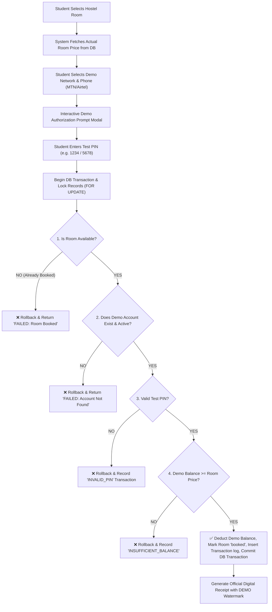

# Implementation Plan - Mobile Money Simulator Redesign (HostelFinder Bushenyi)

Transform the HostelFinder Bushenyi payment system into a formal, secure **Mobile Money Simulator** designed for academic research, project defense, and demonstration purposes. The system will strictly use fictional demo accounts, hashed test PINs, ACID database transactions, concurrency safeguards, and detailed simulated transaction logging.

---

## Technical Architectural Overview

---

## Proposed Changes

### 1. Database & Seeding

#### [MODIFY] [database.sql](file:///C:/Users/David/.gemini/antigravity/scratch/bushenyi_hostels/database.sql)
- Add `mobile_money_accounts` table:
  - `id`, `network` (`MTN`, `Airtel`), `phone_number` (unique), `account_name`, `simulated_balance`, `test_pin_hash`, `status` (`active`, `inactive`), `created_at`, `updated_at`.
- Add `transactions` table:
  - `id`, `booking_id`, `student_id`, `account_id`, `network`, `phone_number`, `amount`, `transaction_ref` (unique), `status` (`PENDING`, `PROCESSING`, `SUCCESSFUL`, `FAILED`, `INSUFFICIENT_BALANCE`, `INVALID_PIN`, `CANCELLED`), `message`, `remaining_balance`, `created_at`.
- Update `bookings` payment statuses to standard enums: `PENDING`, `PROCESSING`, `SUCCESSFUL`, `FAILED`, `INSUFFICIENT_BALANCE`, `INVALID_PIN`, `CANCELLED`.

#### [MODIFY] [seed.php](file:///C:/Users/David/.gemini/antigravity/scratch/bushenyi_hostels/seed.php)
- Seed initial demo Mobile Money accounts:
  1. **MTN Demo**: `0770000001` | UGX 500,000 | Test PIN: `1234`
  2. **Airtel Demo**: `0750000001` | UGX 400,000 | Test PIN: `5678`
  3. **MTN Low Balance Demo**: `0770000002` | UGX 100,000 | Test PIN: `1234`
  4. **Airtel High Balance Demo**: `0700000002` | UGX 1,500,000 | Test PIN: `4321`

---

### 2. Payment Component & Concurrency Safeguard

#### [MODIFY] [student/pay.php](file:///C:/Users/David/.gemini/antigravity/scratch/bushenyi_hostels/student/pay.php)
- Display prominent banner: `DEMO / SIMULATION MODE – NO REAL MONEY IS TRANSFERRED`.
- Fetch actual room price strictly from the database (never trust browser payload).
- Provide selectable test accounts helper for quick testing.
- Interactive modal displaying `MOBILE MONEY DEMO - AUTHORIZATION PROMPT` with clear warning labels (`⚠ DEMONSTRATION ONLY`).
- Implement ACID database transaction logic with `FOR UPDATE` locks:
  - Double booking concurrency protection (prevents 2 students from booking the same room at the exact same millisecond).
  - PIN validation using `password_verify`.
  - Simulated balance verification (`balance >= price`).
  - Detailed error output for `INSUFFICIENT_BALANCE` and `INVALID_PIN` without balance deduction or booking lock-in.

#### [NEW] [student/receipt.php](file:///C:/Users/David/.gemini/antigravity/scratch/bushenyi_hostels/student/receipt.php)
- Standalone digital receipt viewer with print functionality, bearing the official watermark `SIMULATED TRANSACTION – NO REAL MONEY TRANSFERRED`.

---

### 3. Student, Owner, and Admin Dashboards

#### [MODIFY] [student/dashboard.php](file:///C:/Users/David/.gemini/antigravity/scratch/bushenyi_hostels/student/dashboard.php) & [student/my_bookings.php](file:///C:/Users/David/.gemini/antigravity/scratch/bushenyi_hostels/student/my_bookings.php)
- Add **Simulated Transaction History** table showing Transaction Ref, Network, Amount, Room, Date, Status, and Receipt buttons.

#### [MODIFY] [owner/dashboard.php](file:///C:/Users/David/.gemini/antigravity/scratch/bushenyi_hostels/owner/dashboard.php) & [owner/view_bookings.php](file:///C:/Users/David/.gemini/antigravity/scratch/bushenyi_hostels/owner/view_bookings.php)
- Update revenue statistics card to explicitly display `SIMULATED REVENUE`.
- Display transaction reference IDs and payment network details.

#### [NEW] [admin/manage_momo_accounts.php](file:///C:/Users/David/.gemini/antigravity/scratch/bushenyi_hostels/admin/manage_momo_accounts.php)
- Admin tool to:
  - Create new demo Mobile Money accounts.
  - Edit or reset demo balances.
  - Activate/deactivate test accounts.
  - View system-wide transaction logs (`SUCCESSFUL`, `INSUFFICIENT_BALANCE`, `INVALID_PIN`, etc.).

#### [MODIFY] [admin/dashboard.php](file:///C:/Users/David/.gemini/antigravity/scratch/bushenyi_hostels/admin/dashboard.php)
- Include links and widgets for Demo Mobile Money Account Management and Payment Logs.

---

### 4. Automated Testing Suite & Defense Script

#### [NEW] [test_simulator.php](file:///C:/Users/David/.gemini/antigravity/scratch/bushenyi_hostels/test_simulator.php)
- Automated PHP CLI/Web test runner that executes all 6 required test scenarios:
  - **Test 1**: Successful MTN Payment (`0770000001` | Balance 500k vs Price 300k | PIN 1234) -> Expect Success.
  - **Test 2**: Insufficient MTN Balance (`0770000002` | Balance 100k vs Price 300k) -> Expect Failure & `INSUFFICIENT_BALANCE`.
  - **Test 3**: Invalid PIN (`0770000001` | Wrong PIN 9999) -> Expect Failure & `INVALID_PIN`.
  - **Test 4**: Successful Airtel Payment (`0750000001` | Balance 400k vs Price 300k | PIN 5678) -> Expect Success.
  - **Test 5**: Concurrent Booking Protection (Simulated concurrent lock) -> Expect 1 Success, 1 Failure.
  - **Test 6**: Cancelled Payment -> Expect No Balance Deduction & Room Available.

---

### 5. Documentation & Terminology Standardization

#### [MODIFY] [PROJECT_PROPOSAL.md](file:///C:/Users/David/.gemini/antigravity/scratch/bushenyi_hostels/PROJECT_PROPOSAL.md), [README.md](file:///C:/Users/David/.gemini/antigravity/scratch/bushenyi_hostels/README.md), [REFERENCE.md](file:///C:/Users/David/.gemini/antigravity/scratch/bushenyi_hostels/REFERENCE.md)
- Replace all instances of "real Mobile Money integration" or "real PIN authentication" with "Simulated Mobile Money Workflow" and "Test PIN Validation".

---

## Verification Plan

### Automated Testing
- Execute `php test_simulator.php` to run all 6 test scenarios automatically and output color-coded pass/fail logs.

### Manual Verification
- Test all role dashboards (Student, Owner, Admin) and verify receipt printing.
- Sync final updated codebase to `C:\Users\David\Desktop\bushenyi_hostels`.
