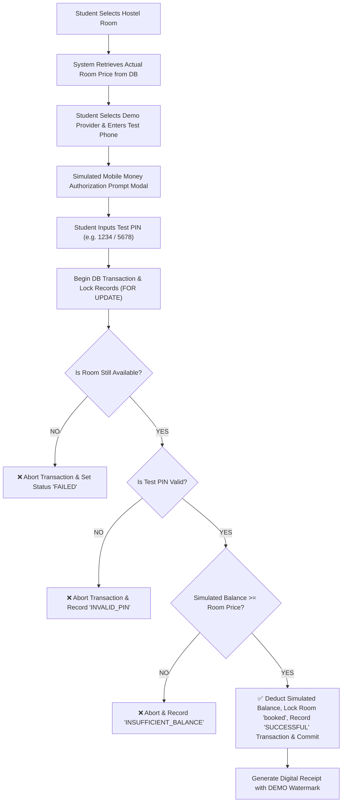

# Project Proposal: HostelFinder Bushenyi

**Automated Student Hostel Booking & Mobile Money Demonstration Environment**

---

## Executive Summary

**HostelFinder Bushenyi** is a web-based hostel booking and payment management system designed to streamline room discovery and rent payments for university students (such as Kampala International University - KIU Western Campus) in Bushenyi District, Uganda.

The platform includes a dedicated **Mobile Money Simulator** supporting **MTN Mobile Money Demo** and **Airtel Money Demo**. The simulator demonstrates how an automated payment workflow operates using fictional test accounts, test PIN validation, simulated balance verification, and ACID database transaction safeguards suitable for academic research and university project defense.

> [!NOTE]
> **DEMONSTRATION & SIMULATION DISCLAIMER**: The system operates strictly within a simulated demonstration environment using fictional test accounts (`0770000001`, `0750000001`, etc.) and fake demo balances. It does NOT connect to live MTN or Airtel financial servers, request real customer PINs, access real customer balances, or transfer real money.

---

## 1. Problem Statement

In educational hubs like Bushenyi & Ishaka Town, students and hostel operators face several operational hurdles:

1. **Manual Room Booking**: Students must walk long distances to inspect and reserve rooms, often arriving after rooms are already fully booked.
2. **Uncertain Payment Verification**: Cash payments and manual bank transfers lead to delays, missing receipts, and disputes between students and landlords.
3. **Transaction Failures & Overdraft Risks**: Payments frequently fail silently when students have insufficient funds or enter invalid PINs, leading to double-booking confusion.

---

## 2. Proposed Solution & Simulator Architecture

**HostelFinder Bushenyi** provides a centralized, mobile-responsive portal that automates the end-to-end booking workflow using atomic database transactions:

---

## 3. Key System Features

### 🎓 A. Student Portal
- **Interactive Hostel Discovery**: Search by price, location (KIU Road, Ishaka Town, Kashenyi, Katungu), and room type (Single, Double, Self-contained).
- **Simulated Payment Prompt Modal**: Interactive prompt simulating payment authorization for **MTN Mobile Money Demo** and **Airtel Money Demo**.
- **Simulated Balance Safeguard**: The application checks the balance of a simulated Mobile Money account maintained within the application's demonstration environment; aborts transaction if simulated funds are less than the room price.
- **Digital Receipts & Payment History**: View booking logs, status badges (`SUCCESSFUL`, `INSUFFICIENT_BALANCE`, `INVALID_PIN`), and print digital receipts.

### 🏢 B. Hostel Owner Portal
- **Property Management**: Register hostels, set pricing, upload photos, and outline amenities (WiFi, 24/7 Security, Water, Standby Generator).
- **Room Inventory Control**: Add rooms (Block/Room numbers) and track live availability.
- **Simulated Revenue & Booking Tracker**: View real-time payment confirmations, student details, and revenue labeled clearly as `SIMULATED REVENUE`.

### 🛡️ C. System Administrator Portal
- **Demo Account Management**: Create fictional test Mobile Money accounts, edit/reset simulated balances, and activate or deactivate test accounts.
- **System Audit Logs**: Filter and review simulated payment transaction logs (`SUCCESSFUL`, `INSUFFICIENT_BALANCE`, `INVALID_PIN`, `FAILED`, `CANCELLED`).
- **Hostel Approvals**: Review and approve newly submitted hostels to ensure safety and quality standards.

---

## 4. Technical Architecture & Stack

| Layer | Technology Stack |
| :--- | :--- |
| **Frontend** | HTML5, CSS3, JavaScript (ES6+), Bootstrap 5, Bootstrap Icons |
| **Backend** | PHP 8.x (Object-Oriented, Prepared Statements & ACID DB Transactions) |
| **Database** | MySQL / MariaDB (`mydb` schema with `mobile_money_accounts` & `transactions`) |
| **Payment Gateway** | Mobile Money Simulator & Test PIN Authorization Engine |
| **Security** | Hashed Test PINs (`password_hash`), Session Auth, SQL Injection & Concurrency Protection |

---

## 5. Transaction Integrity & Concurrency Safeguard

> [!IMPORTANT]
> **Academic Demonstration & Financial Safeguard Rules:**
> 1. **Test PIN Validation**: The system validates the test PIN associated with the simulated Mobile Money account using secure hashing (`password_verify`).
> 2. **Simulated Balance Rule**:
>    $$\text{Status} = \begin{cases} \text{SUCCESSFUL} & \text{if } \text{Simulated Balance} \ge \text{Room Price} \\ \text{INSUFFICIENT\_BALANCE} & \text{if } \text{Simulated Balance} < \text{Room Price} \end{cases}$$
> 3. **Concurrency Control**: Database locks (`SELECT ... FOR UPDATE`) prevent double-booking when two students attempt to reserve the same room simultaneously.

---

## 6. Testing Scenarios & Validation Matrix

The system includes an automated test runner (`test_simulator.php`) verifying 6 core scenarios:

| Test Scenario | Test Account & Inputs | Expected Outcome | Result |
| :--- | :--- | :--- | :--- |
| **Test 1: Successful MTN Payment** | `0770000001` (Bal 500k vs Price 300k, PIN 1234) | Status: `SUCCESSFUL`, Bal: 200k, Room: `booked` | **[PASSED]** |
| **Test 2: Insufficient MTN Balance** | `0770000002` (Bal 100k vs Price 300k) | Status: `INSUFFICIENT_BALANCE`, Bal: 100k (Unchanged), Room: `available` | **[PASSED]** |
| **Test 3: Invalid Test PIN** | `0770000001` (Wrong PIN 9999) | Status: `INVALID_PIN`, Bal: Unchanged, Room: `available` | **[PASSED]** |
| **Test 4: Successful Airtel Payment** | `0750000001` (Bal 400k vs Price 300k, PIN 5678) | Status: `SUCCESSFUL`, Bal: 100k, Room: `booked` | **[PASSED]** |
| **Test 5: Concurrent Booking Lock** | 2 Students booking Room `CONCURRENCY-999` simultaneously | Student A: `SUCCESSFUL`, Student B: `FAILED` (Room no longer available) | **[PASSED]** |
| **Test 6: Cancelled Payment** | Student cancels inside simulation modal | Status: `CANCELLED`, Bal: Unchanged, Room: `available` | **[PASSED]** |

---

## 7. Expected Impact & Academic Relevance

- **100% Demonstration Integrity**: Demonstrates an automated payment architecture suitable for university project defense.
- **Zero Real Financial Risk**: Operates entirely within a fictional sandbox using hashed test PINs.
- **Concurrency Protection**: Demonstrates ACID database locking against race conditions.
